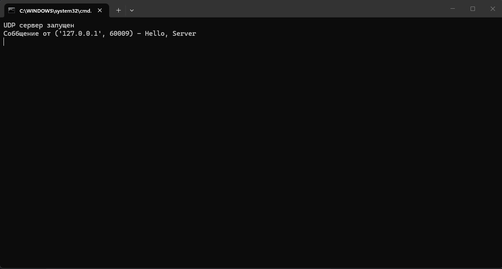
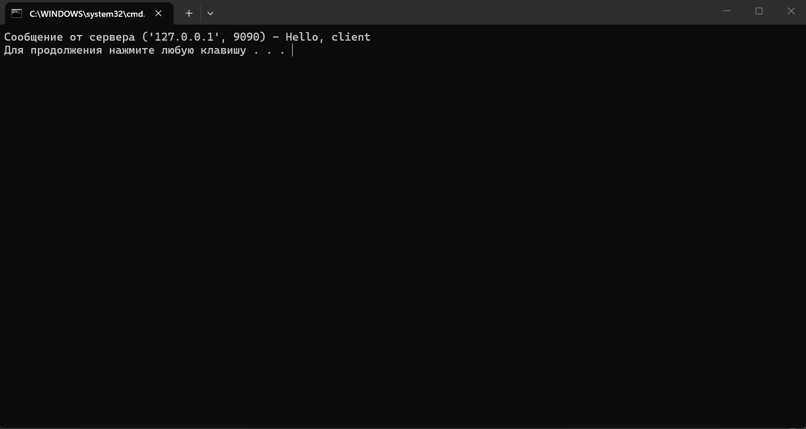

# Практическое задание 1
## Обмен сообщениями по UDP

---

> **Требования:**

> 1.  Обязательное спользование библиотеки ```socket```
> 2.  Реализация через протокол ```UDP```


 **Задание:**
```
Реализовать клиентскую и серверную часть приложения. 
Клиент отправляет серверу сообщение «Hello, server», 
и оно должно отобразиться на стороне сервера. В ответ сервер 
отправляет клиенту сообщение «Hello, client», 
которое должно отобразиться у клиента.
```

### Ход работы:
---
**Написание серверной части**

Код будет состоять из двух файлов. В первом из них будут заданы команды для сервера. 
Ниже привожу полный код серверной части:

```
import socket

sock = socket.socket(socket.AF_INET, socket.SOCK_DGRAM)
sock.bind(('', 9090))
print("UDP сервер запущен")

while True:
    data, client_info = sock.recvfrom(1024)
    if not data:
        break

    client_message = data.decode('utf-8')
    print(f"Соббщение от {client_info} - {client_message}")

    response = "Hello, client"
    sock.sendto(response.encode('utf-8'), client_info)

sock.close()
input()

```

*Пояснение:* 

С помощью библиотеки ```socket``` создан объект розетки. Во второй строке кода параметры в скобках
указывают на то, что это именно ```UDP``` socket, это необходимо указать, так как по умолчанию команда
```socket.socket()``` создаёт ```TCP``` socket. Далее розетка назначена слушать порт ```9090``` и любое
устройство, которое хочет подключиться по этому порту. После выводится сообщение и том, что сервер запущен.
Далее с помощью команды ```recvfrom``` в цикле, socket слушает порт и принимает данные поступающие в него.
Данные приходят кортежем ```(сообщение, хост и адрес устройства)```, этот кортеж разбивается и записывается в
2 переменные. Далее сообщение расшифровываетя и выводится на экран.

После получения сообщения сервер отправляет зашифрованный в байты ответ и закрывает прослушивание порта.

---
**Написание клиентской части:**

Здесь проще, порт прослушивать не надо, только написать соощение и указать адрес, на который необходимо его доставить, а затем получить и расшифровать ответ сервера.

Ниже привожу полный код клиентской части:

```
import socket

sock = socket.socket(socket.AF_INET, socket.SOCK_DGRAM)

server_address = ('localhost', 9090)
message = "Hello, Server"

sock.sendto(message.encode('utf-8'), server_address)

data, server_info = sock.recvfrom(1024)
sock.close()

print(f"Сообщение от сервера {server_info} - {data.decode('utf-8')}")
```

*Пояснение:*

Снова создан ```socket``` и указан адрес сервера. В этот раз важно указать, что сервер это ```localhost```. Затем сообщение от клиента переводится в байты и
отправляется по адресу сервера. Потом с помощью той же команды ```recvfrom``` читается ответ от сервера, который далее переводится в читаемую строку и выводится на экран.


---
**Результат:**
Сначала запустим сервер, после получения сообщения о том, что он работает, запустим клиентский код и посмотим на результат:

*Сервер:*




---
*Клиент:*



---
Клиент отправил сообщение на сервер, сервер его получил, вывел, написал ответ, отправил его, клиент получил ответ и тоже его вывел. Первое практическое задание успешно выполнено.


