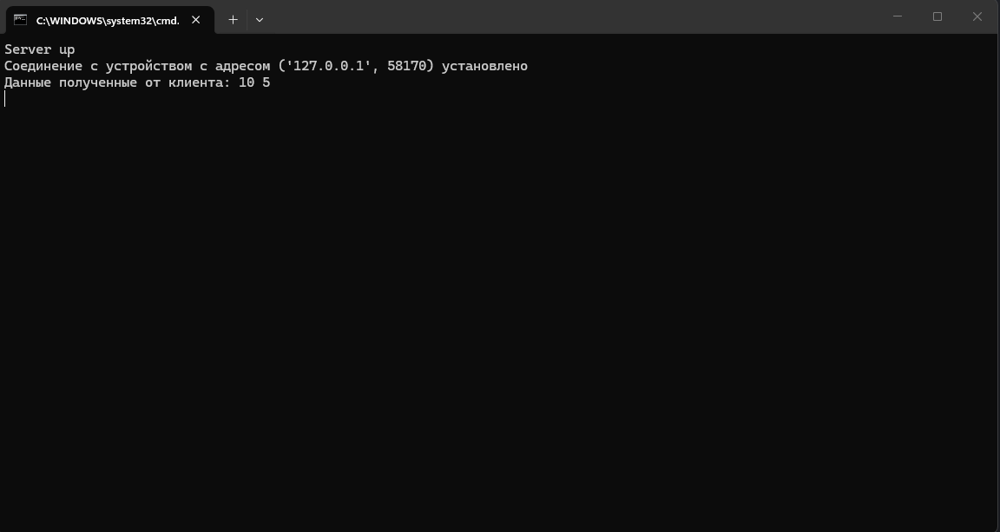
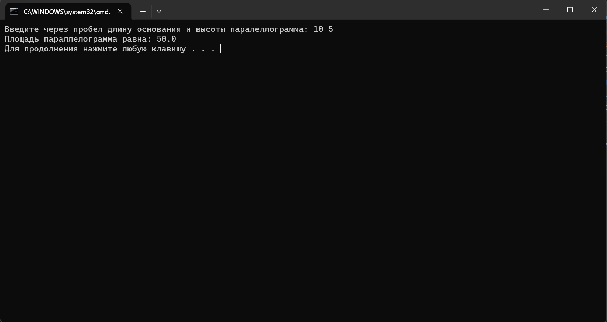

## Вычисления через TCP
---

> **Требования:**

> 1. Обязательное использование библиотеки socket

> 2. Реализация с помощью протокола TCP

> 3. Необходимая операция - поиск площади параллелограмма (так как номер в журнале - 36)

**Задание:**
```
Реализовать клиентскую и серверную часть приложения. Клиент запрашивает 
выполнение математической операции, параметры которой вводятся с клавиатуры. 
Сервер обрабатывает данные и возвращает результат клиенту.
```
---
### Ход работы:
---

**Серверная часть:**

Снова начинаем писать код с серверной части.

Сначала с помощью библиотеки ```socket``` создаем розетку и говорим ей слушать порт ```9090```, но на этот раз socket создается с другим аргументом, соответствующем розетке с ```TCP``` передачей данных. Ниже блок кода с вышеописанными операциями:

```
import socket

sock = socket.socket(socket.SOCK_STREAM)

sock.bind(('', 9090))

print("Server up")
```
---
Далее заставляем socket слушать на порту и когда соединение с клиентом установлено выводим сообщение об этом с адресом клиента. 

Код:

```
sock.listen(1)
client_sock, client_address = sock.accept()
print(f"Соединение с устройством с адресом {client_address} установлено")
```

---
Затем дожидаеся данных от клиента, с помощью ```try``` и ```catch``` проверяем валидность полученных данных и считаем площадь параллелограмма. Если все успешно, возвращаем результат клиенту, если нет - клиенту возвращаем сообщения об ошибках.

Код:

```
while True:
    client_data = client_sock.recv(1024)
    if not client_data:
        break
    recived_data = client_data.decode('utf-8')
    print(f"Данные полученные от клиента: {recived_data}")

    try:
        parts = recived_data.split()
        if len(parts) == 2:
            osnovanie = float(parts[0])
            vysota = float(parts[1])

            S = osnovanie*vysota

            client_sock.sendall((f"Площадь параллелограмма равна: {S}").encode('utf-8'))
        else:
            client_sock.sendall(("Должно быть введено 2 числа через проблем").encode('utf-8'))
    except:
        client_sock.sendall((f"Неверный формат следующих данных: {recived_data}").encode('utf-8'))

client_sock.close()
sock.close()
input()
```

На этом код сервера завершен.

---
**Клиентская часть:**

С ней все снова значительно проще. Создаем ```socket```, соединяем его с сервером по порту, читаем данные с клавиатуры, кодируем в биты, отправляем на сервер.
Затем получаем ответ от сервера, декрдиуем в читаемый вид и выводим на экран.

Код:

```
import socket

sock = socket.socket(socket.AF_INET, socket.SOCK_STREAM)
sock.connect(('localhost', 9090))

data = input("Введите через пробел длину основания и высоты паралеллограмма: ")
message = data.encode('utf-8')

sock.send(message)

S = sock.recv(1024)
result = S.decode('utf-8')

print(result)

sock.close()
```
---
### Результат:

Серверная часть:



---
Клиентская часть:




---
Данные введены со стороны клиента, отправлены на сервер, проверены на корректность, с ними проделаны операции, результат операций отправлен клиенту. Результат корректен. На этом работа над вторым практическим заданием завершена.

